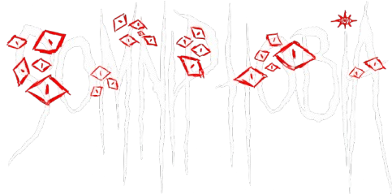
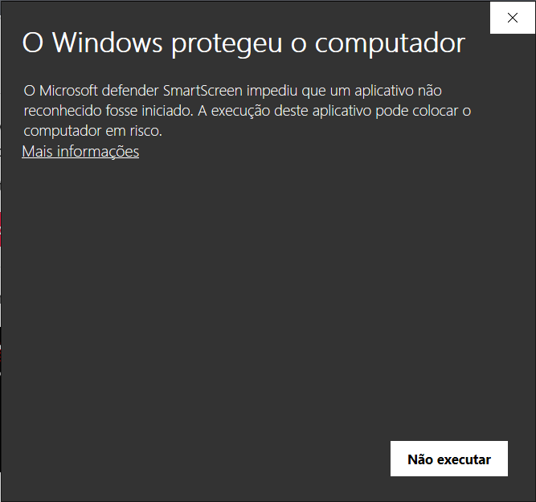
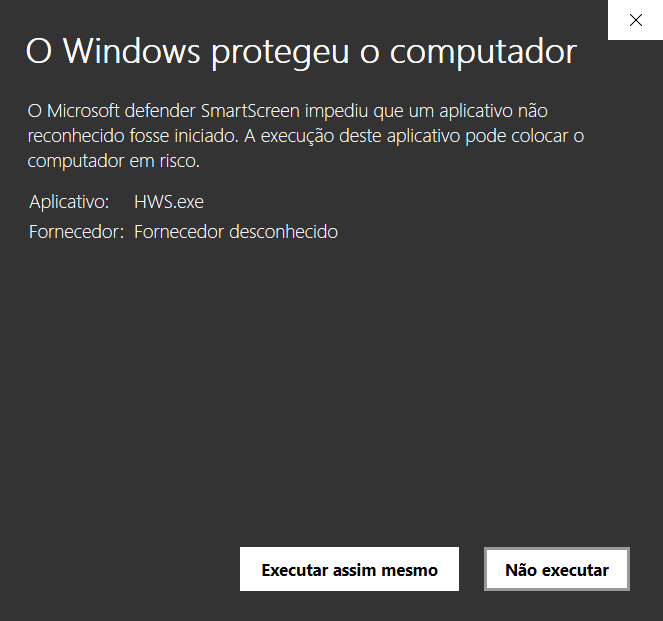
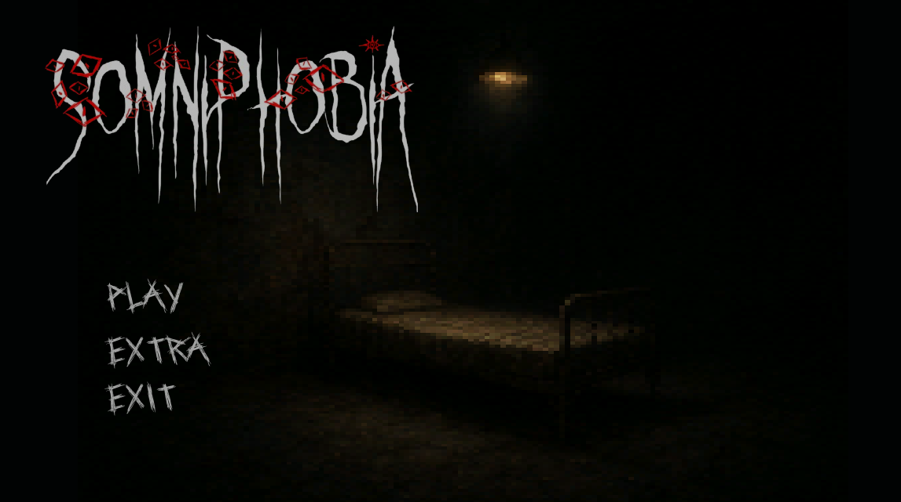

<<<<<<< HEAD
  

**Somniphobia** é um jogo de simulação e terror em estilo *low-poly*, inspirado nos gráficos do PS1, onde você controla um garoto preso em um pesadelo surreal. O objetivo é escapar desse mundo corrompido para finalmente acordar.
=======
  

**Somniphobia** é um jogo de simulação e terror em estilo *low-poly*, inspirado nos gráficos do PS1, onde você controla um garoto preso em um pesadelo surreal dentro de sua escola distorcida. O objetivo é escapar desse mundo corrompido para finalmente acordar.
>>>>>>> 74b14751a69565a81a3bfd770c9cd936a7608304

---

## 📖 Sinopse
<<<<<<< HEAD
O protagonista é apenas mais um estudante comum, exausto pela rotina pesada e pelas infinitas cobranças da escola. Entre cadernos, provas e longas horas de aula, o sono finalmente o vence. Mas, ao fechar os olhos, ele desperta em um lugar diferente — uma versão distorcida da própria escola.

 Cada disciplina guarda uma questão, como se a própria escola o estivesse testando, julgando se ele é digno de sair dali.

No entanto, não há apenas perguntas esperando por ele. No escuro dos corredores, uma entidade sombria persegue o protagonista. Ninguém sabe se é fruto de sua mente cansada, de algo que despertou ao brincar com forças que não deveria, ou apenas o reflexo da pressão esmagadora da vida escolar.

Entre salas abandonadas, labirintos sem fim e a constante necessidade de manter sua lanterna acesa, o aluno deve lutar contra o medo, responder às questões e encontrar a saída.
=======
Você é **Lucas**, um estudante comum que, toda vez que adormece, é transportado para uma versão aterrorizante de sua escola. As paredes se contorcem, os corredores se estendem infinitamente e criaturas desconhecidas espreitam nas sombras. Para escapar, você precisa explorar, resolver quebra-cabeças e enfrentar os horrores desse mundo invertido antes que o pesadelo o consuma para sempre.
>>>>>>> 74b14751a69565a81a3bfd770c9cd936a7608304

---

## 🎮 Características do Jogo
<<<<<<< HEAD
- **Estilo Visual Único:** Gráficos *low-poly* nostálgicos, reminiscentes do PS1, com atmosfera sombria.
- **Exploração Sombria:** Navegue pelo o pesadelo, descubra segredos e encontre itens para progredir.
- **Terror Psicológico:** Ambiente opressivo, sons perturbadores e encontros sobrenaturais.
- **Quebra-Cabeças Desafiadores:** Resolva enigmas para desvendar a verdade por trás do pesadelo.
=======
- **Estilo Visual Único:** Gráficos *low-poly* nostálgicos, reminiscentes do PS1, com atmosfera sombria e distorcida.
- **Exploração Sombria:** Navegue pela escola corrompida, descubra segredos e encontre itens para progredir.
- **Terror Psicológico:** Ambiente opressivo, sons perturbadores e encontros sobrenaturais.
- **Quebra-Cabeças Desafiadores:** Resolva enigmas para desbloquear novas áreas e desvendar a verdade por trás do pesadelo.
- **Mundo Dinâmico:** A escola muda sutilmente a cada vez que você dorme, mantendo a experiência assustadora e imprevisível.
>>>>>>> 74b14751a69565a81a3bfd770c9cd936a7608304

---

## 🕹️ Controles
<<<<<<< HEAD
- **WASD** → Movimentação
- **E** → Interagir
=======
- **WASD / Setas** → Movimentação
- **E / Enter** → Interagir
>>>>>>> 74b14751a69565a81a3bfd770c9cd936a7608304
- **Shift** → Correr
- **Espaço** → Pular
- **F** → Usar lanterna (se aplicável)
- **ESC** → Menu/Pausa

---

## 🛠️ Tecnologia
- **Engine:** Godot 
- **Plataformas:** PC
- **Gênero:** Terror Psicológico / Simulação / Survival Horror

---

## 📥 Instalação
<<<<<<< HEAD
1. Baixe o arquivo `.zip` da versão mais recente  [aqui](https://drive.google.com/drive/folders/1InfiGIMHPmzTPzB7T8kQqYwBv89Sx-YL?usp=drive_link).
2. Extraia o conteúdo.
3. Execute `Somniphobia.exe`.

## 📥 Instalação
1. Baixe o arquivo `.zip` da versão mais recente [aqui](https://drive.google.com/drive/folders/1InfiGIMHPmzTPzB7T8kQqYwBv89Sx-YL?usp=drive_link).
2. Extraia o conteúdo.
3. Execute o arquivo **`Somniphobia.exe`**.

---

## ⚠️ Aviso do Windows
Ao executar o jogo, o Windows pode exibir um aviso de segurança semelhante a este:

  
  

🔹 Isso acontece porque o jogo foi exportado pela engine **Godot**, e o Windows não reconhece automaticamente a assinatura do arquivo.  
✅ O jogo **não contém nenhum tipo de arquivo malicioso**, podendo ser executado com segurança.

# 📸 Capturas de Tela

  
  
  

=======
1. Baixe o arquivo `.zip` da versão mais recente [aqui](#) *(adicione link)*.
2. Extraia o conteúdo.
3. Execute `Somniphobia.exe`.

---

## 📸 Capturas de Tela 

- _Em breve_

---
>>>>>>> 74b14751a69565a81a3bfd770c9cd936a7608304
