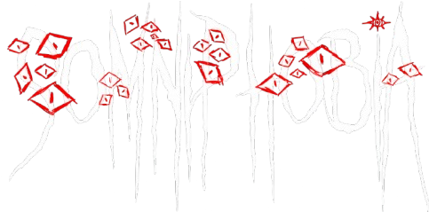

  

**Somniphobia** é um jogo de simulação e terror em estilo *low-poly*, inspirado nos gráficos do PS1, onde você controla um garoto preso em um pesadelo surreal dentro de sua escola distorcida. O objetivo é escapar desse mundo corrompido para finalmente acordar.

---

## 📖 Sinopse
Você é **Lucas**, um estudante comum que, toda vez que adormece, é transportado para uma versão aterrorizante de sua escola. As paredes se contorcem, os corredores se estendem infinitamente e criaturas desconhecidas espreitam nas sombras. Para escapar, você precisa explorar, resolver quebra-cabeças e enfrentar os horrores desse mundo invertido antes que o pesadelo o consuma para sempre.

---

## 🎮 Características do Jogo
- **Estilo Visual Único:** Gráficos *low-poly* nostálgicos, reminiscentes do PS1, com atmosfera sombria e distorcida.
- **Exploração Sombria:** Navegue pela escola corrompida, descubra segredos e encontre itens para progredir.
- **Terror Psicológico:** Ambiente opressivo, sons perturbadores e encontros sobrenaturais.
- **Quebra-Cabeças Desafiadores:** Resolva enigmas para desbloquear novas áreas e desvendar a verdade por trás do pesadelo.
- **Mundo Dinâmico:** A escola muda sutilmente a cada vez que você dorme, mantendo a experiência assustadora e imprevisível.

---

## 🕹️ Controles
- **WASD / Setas** → Movimentação
- **E / Enter** → Interagir
- **Shift** → Correr
- **Espaço** → Pular
- **F** → Usar lanterna (se aplicável)
- **ESC** → Menu/Pausa

---

## 🛠️ Tecnologia
- **Engine:** Godot 
- **Plataformas:** PC
- **Gênero:** Terror Psicológico / Simulação / Survival Horror

---

## 📥 Instalação
1. Baixe o arquivo `.zip` da versão mais recente [aqui](#) *(adicione link)*.
2. Extraia o conteúdo.
3. Execute `Somniphobia.exe`.

---

## 📸 Capturas de Tela 

- _Em breve_

---
